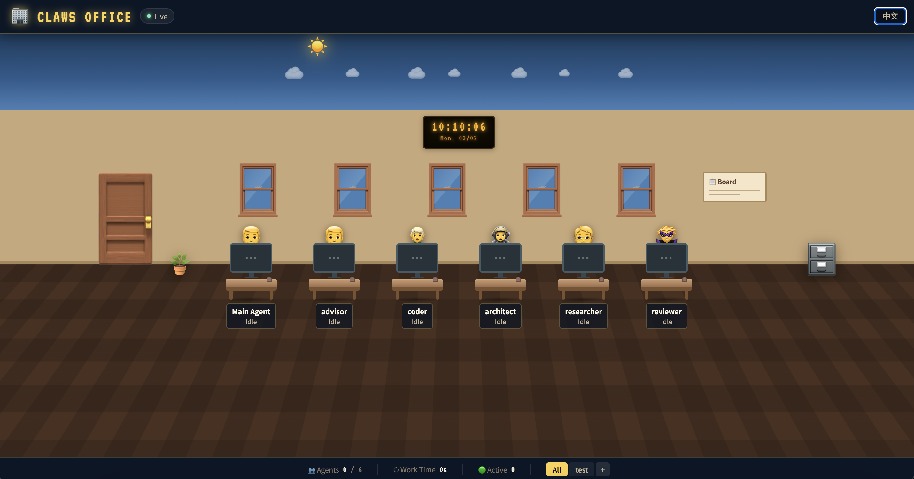
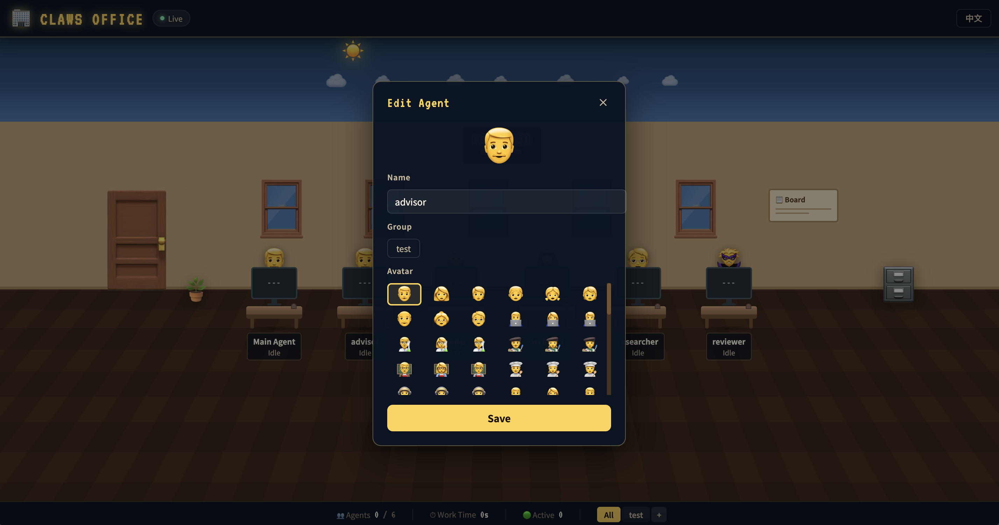

# Claws Office

A real-time monitoring dashboard for OpenClaw agents with an office-themed UI.

## Features

- 🔄 **Real-time Status Monitoring** — SSE-based live updates
- 🤖 **Agent Task Visualization** — Workstations show avatar, monitor status, current task
- 🎮 **Game-style UI** — Office scene with day/night cycle
- 🌙 **Day/Night Cycle** — Time-based sky (day/dusk/night), stars, meteors, moon
- ✏️ **Agent Editing** — Click avatar to edit name, avatar, group
- 👥 **Group Management** — Add/delete groups, filter by group
- 🌐 **Bilingual** — Chinese/English support

## Screenshot

<!-- Add your screenshot here -->



## Tech Stack

- React 18 + TypeScript
- Vite
- Framer Motion (animations)
- Server-Sent Events (real-time updates)
- CSS3 (gradients, perspective effects)

## Quick Start (npm)

```bash
# Install dependencies
npm install

# Development
npm run dev

# Production
npm run build
npm start
```

## Docker

```bash
# Build image
docker build -t claws-office .

# Run container
docker run -d -p 3000:3000 --name claws-office claws-office
```

Visit http://localhost:3000

## Project Structure

```
├── src/
│   ├── components/
│   │   ├── WorkstationCard.tsx   # Workstation card component
│   │   └── AgentEditPanel.tsx    # Agent edit modal
│   ├── App.tsx                   # Main app component
│   ├── App.css                   # Main styles
│   └── index.css                 # Global styles
├── server/
│   ├── index.js                  # Dev backend API server
│   └── prod.js                   # Production server
├── Dockerfile
└── README.md
```

## Backend API

- `GET /api/config` — Get groups and agent config
- `GET /api/agents` — Get all agent statuses
- `GET /api/agents/stream` — SSE real-time updates
- `POST /api/config/agent/:id` — Update agent info
- `POST /api/config/agent/:id/group` — Update agent group
- `POST /api/groups` — Add group
- `DELETE /api/groups/:id` — Delete group

---

# Claws Office

实时监控 OpenClaw 所有 Agent 工作状态的 Web 应用，办公室风格的监控面板。

## 功能特性

- 🔄 **实时状态监控** — 通过 SSE 实时获取 Agent 工作状态
- 🤖 **Agent 任务可视化** — 每个工位显示员工头像、显示器状态、当前任务
- 🎮 **游戏化 UI** — 办公室场景，支持日夜循环
- 🌙 **日夜循环** — 根据时间显示白天/黄昏/夜晚，星星、流星、月亮
- ✏️ **员工编辑** — 点击员工头像修改姓名、头像、所属分组
- 👥 **分组管理** — 添加、删除分组，按分组筛选显示
- 🌐 **中英文双语** — 支持中文/英文切换

## 截图

<!-- 在此添加截图 -->
<!--  -->

## 快速开始 (npm)

```bash
# 安装依赖
npm install

# 开发模式
npm run dev

# 生产模式
npm run build
npm start
```

## Docker

```bash
# 构建镜像
docker build -t claws-office .

# 运行容器
docker run -d -p 3000:3000 --name claws-office claws-office
```

访问 http://localhost:3000

## 目录结构

```
├── src/
│   ├── components/
│   │   ├── WorkstationCard.tsx   # 工位卡片组件
│   │   └── AgentEditPanel.tsx    # 员工编辑面板
│   ├── App.tsx                   # 主应用组件
│   ├── App.css                   # 主样式
│   └── index.css                 # 全局样式
├── server/
│   ├── index.js                  # 开发环境后端
│   └── prod.js                   # 生产环境服务器
├── Dockerfile
└── README.md
```

## 后端 API

- `GET /api/config` — 获取分组和员工配置
- `GET /api/agents` — 获取所有 Agent 状态
- `GET /api/agents/stream` — SSE 实时推送
- `POST /api/config/agent/:id` — 更新员工信息
- `POST /api/config/agent/:id/group` — 更新员工分组
- `POST /api/groups` — 添加分组
- `DELETE /api/groups/:id` — 删除分组
